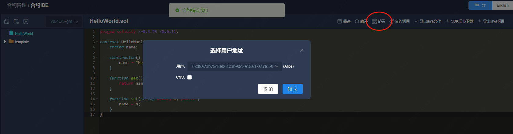
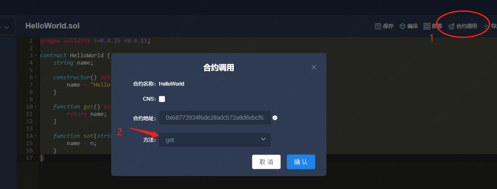
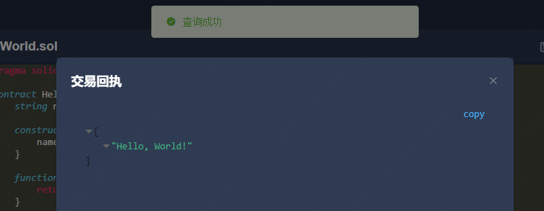
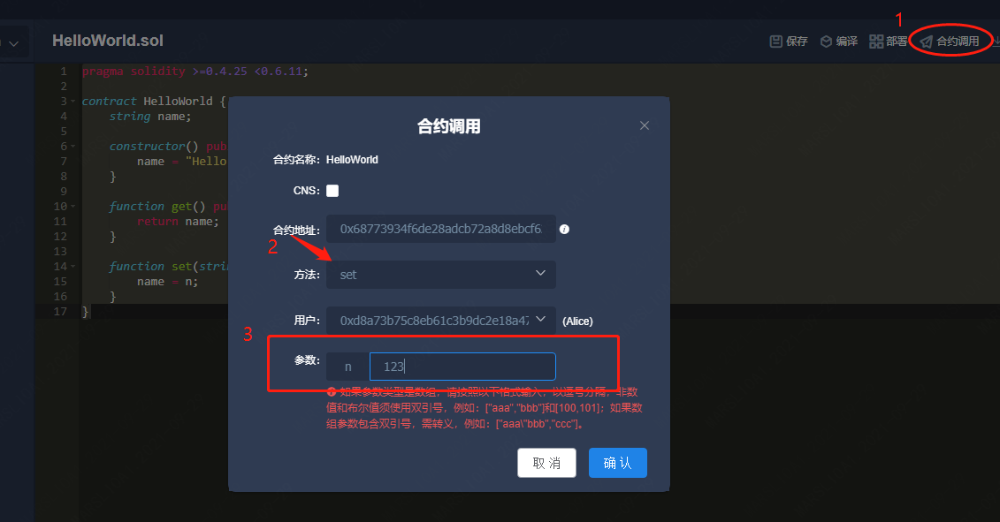
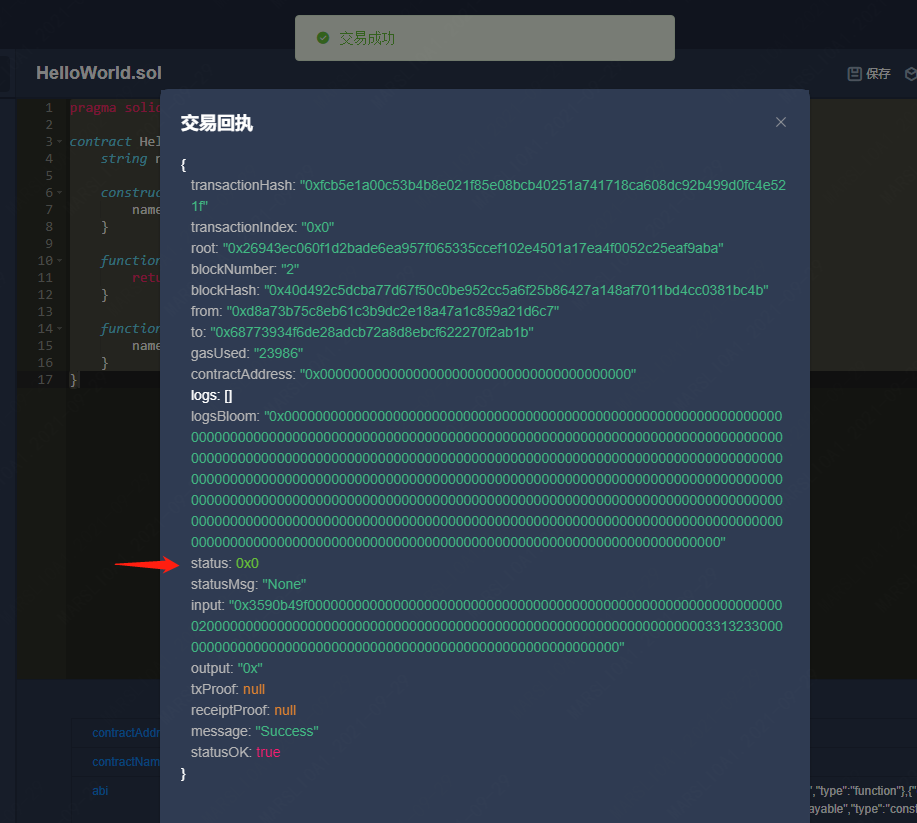
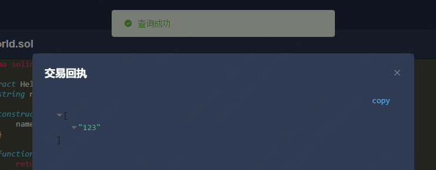

# 实训1 运行第一个智能合约

## 题目描述

<!-- 这里写题目描述 -->

编写一个HelloWorld合约，合约包含一个string变量、一个get方法和一个set方法。
- 构造函数初始化该变量为"Hello world!"
- 提供get方法获取变量string的值（调用get方法不产生区块）
- 提供set方法设置string的值（产生区块）

#### 示例1
```
编译合约，创建私钥用户，通过合约IDE部署合约。
```

#### 示例2
```
部署合约后，直接调用get方法，获得string的返回值为"Hello world!"。
```

#### 示例3
```
调用set方法，设置string为"123"，获得交易回执，回执状态为0x0(成功)。

调用get方法，获取string的值，显示为"123"。
```


## 解法

<!-- 这里可写通用的实现逻辑 -->

伪代码

```ts
pragma solidity >=0.4.25 <0.6.11;
contract HelloWorld {
    string a;
    constructor;
    getter;
    setter;
}
```

<!-- tabs:start -->

### **Solidity**

<!-- 这里可写当前语言的特殊实现逻辑 -->

```ts
pragma solidity >=0.4.25 <0.6.11;

contract HelloWorld {
    string name;

    constructor() public {
        name = "Hello, World!";
    }

    function get() public view returns (string memory) {
        return name;
    }

    function set(string memory n) public {
        name = n;
    }
}
```


<!-- tabs:end -->


## 操作图示

<!-- 以下添加验证合约的操作 -->


#### 示例1
```
通过合约IDE部署合约。
```

合约IDE中创建合约，点击“编译”按钮编译合约，点击“部署”按钮部署合约。若不存在私钥用户，则在“合约管理-测试用户”中创建一个新的私钥用户。



部署后，合约IDE中下方将显示合约的地址。

#### 示例2
```
部署合约后，直接调用get方法，获得string的返回值为"Hello world!"。
```

点击合约调用，选中“get”方法，点击“确定”进行调用


“get”方法返回了合约的string值


#### 示例3

```
调用set方法，设置string为"123"，获得交易回执，回执状态为0x0(成功)。

调用get方法，获取string的值，显示为"123"。
```

点击合约调用，选中“set”方法，选中一个私钥用户（默认会自动选中一个），在输入框中填入参数“123”，点击“确定”进行调用。


“set”方法修改了链上的值，返回了一个交易回执，交易回执中状态为“0x0”代表交易成功了。


同样的方法调用“get”方法，返回了“123”，代表合约中保存的string值为“123”，刚才的“set”操作成功了。

